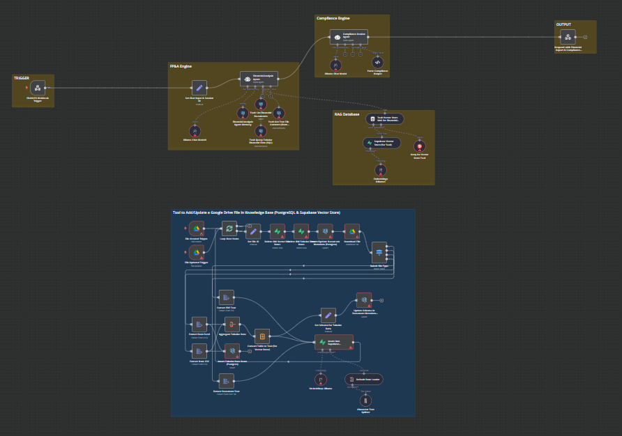
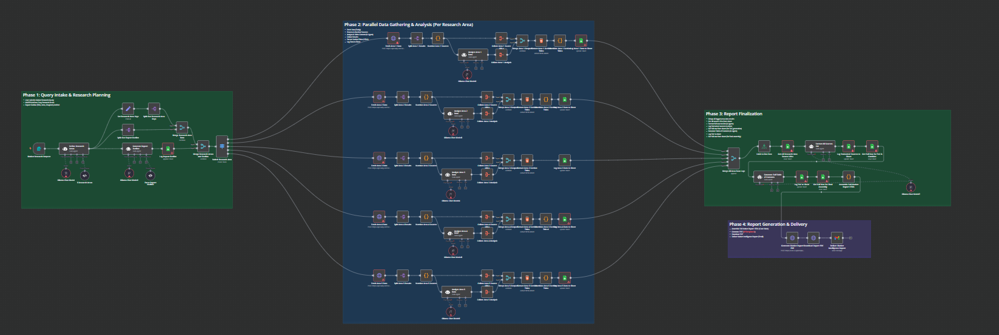
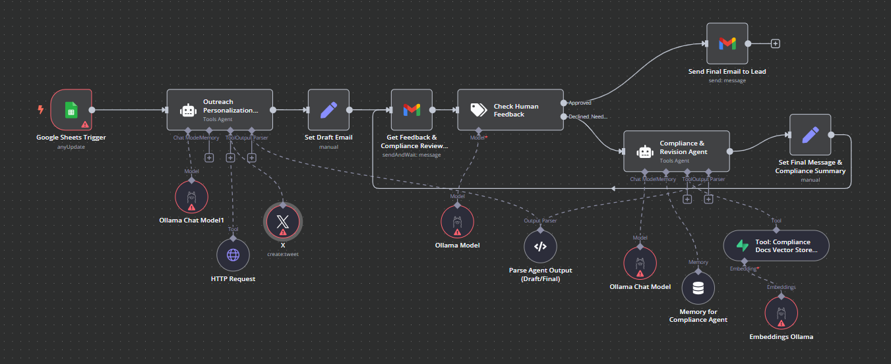
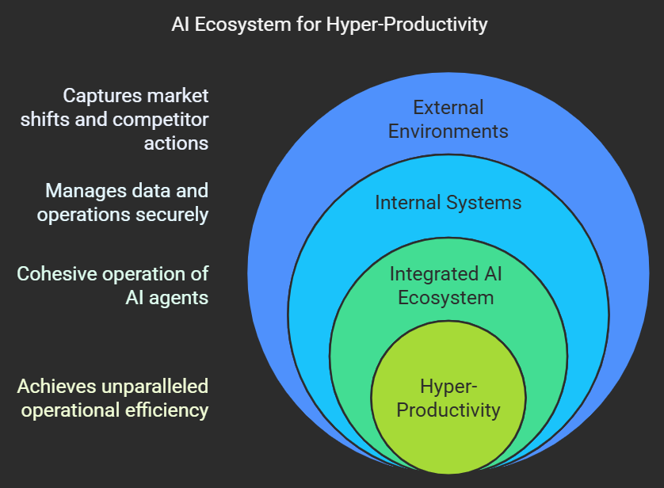

# Ai-agent-ecosystem
Meet a team of AI-powered specialists. Each agent is a powerhouse on its own, but when seamlessly connected, they form an AI Ecosystem that unlocks hyper-productivity, transforming manual tasks into human-supervised strategic endeavors.
# F.R.A.N.C.E.S.
Financial Reporting & Analysis Navigator & Compliance Engine Specialist

**The Challenge:**   
Traditional AI struggles with tabular data in finance/compliance, and sensitive data needs local hosting.

**My Solution:**  
Developed a locally hosted, multimodal AI agent to overcome RAG limitations for tabular data using PostgreSQL alongside vector database retrieval. Reliably processes financial documents (CSV, Excel, PDF, text) for accurate analysis, generating PDF reports and linking to a data visualization tool.

**Impact & Results:**   
Enhanced accuracy in financial reporting
Accelerated reporting cycles
Increased data security with local hosting
Provided deeper financial insights

**Key Features:**  
PostgreSQL,
Local embedding model,
Multimodal Interfaces,
PDF Generation,
Vector Database Retrieval.

# M.A.R.T.I.N.
Market Analysis & Research Team Intelligence Navigator

**The Challenge:**   
Businesses struggle with manual, time-consuming market research and outdated competitive insights.

**My Solution:**  
Engineered a Deep Research Agent swarm to autonomously gather, analyze, and synthesize external market data (trends, competitors, sentiment). Features a parallelization of thought architecture with concurrent sub-agents for efficient and comprehensive research.

**Impact & Results:**   
Real-time market awareness
Proactive strategy formulation
Reduced research costs
Data-driven product innovation

**Key Features:**  
Parallelization of Thought,
Custom Web Scrapers,
APIs,
NLP,
Multimodal Input/Output.

# A.R.I.E.S.
Automated Relationship Initiation & Engagement Specialist

**The Challenge:**   
Scaling personalized sales outreach is inefficient and generic messages fail to convert.

**My Solution:**  
Developed a Human-in-the-Loop AI Sales Outreach Agent to automate and hyper-personalize initial client engagement at scale. Integrates with CRM, scrapes LinkedIn for prospect data, and uses NLP to draft tailored outreach messages. Crucially, it saves drafts in Gmail for human review and approval.

**Impact & Results:**   
Hyper-personalized outreach at scale
Massive time savings for sales teams
Enhanced lead quality and conversion
Maintained human oversight and quality

**Key Features:**  
GPT-based models,
CRM integration,
LinkedIn scraping,
Gmail API,
Custom Web Scraping,
Human-in-the-Loop Framework

# THE ECO-SYSTEM
While each of my AI agents is engineered for distinct, high-impact capabilities, their true transformative power is unleashed when they operate as a cohesive, intelligent ecosystem. This integrated approach facilitates seamless synergy between a company's internal systems—handling sensitive data and operational realities—and dynamic external environments—capturing real-time market shifts and competitor actions. By connecting these specialized agents, we create a more secure, robust, and intelligent operational fabric, ensuring that decisions are always informed by the most comprehensive internal and external insights, moving beyond isolated automation to achieve unparalleled hyper-productivity where human intuition guides, not grinds.

# Get Started
To run the agents, follow these steps:
